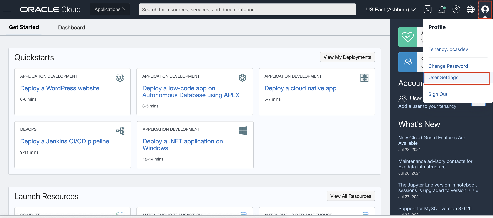
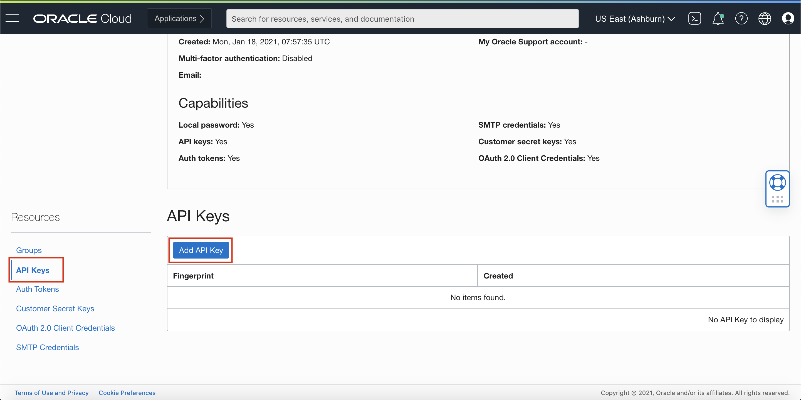
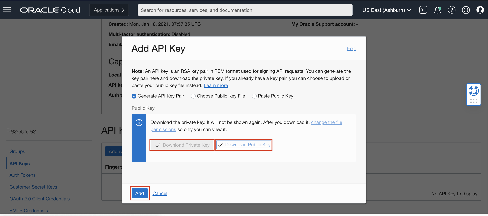
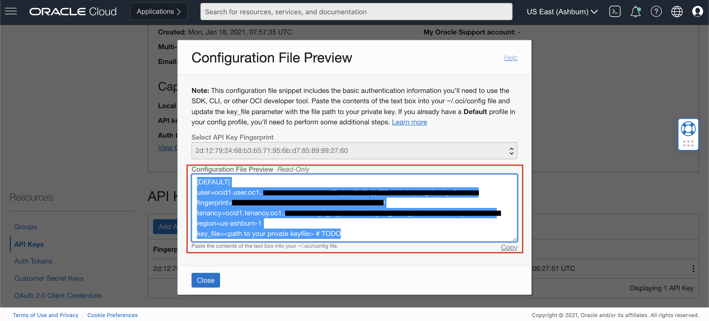
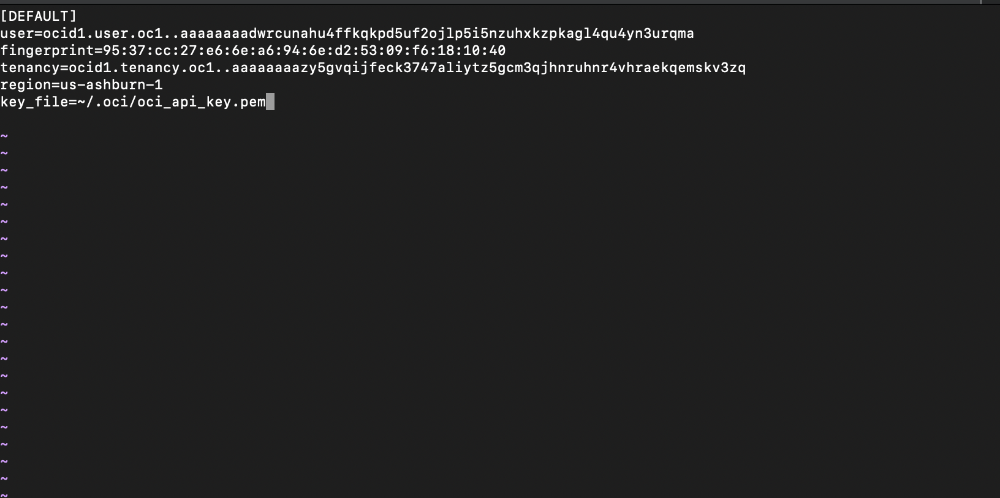

# Lab 3: Access OCI Speech with OCI SDKs

## Introduction 

Oracle Cloud Infrastructure provides a number of Software Development Kits (SDKs) to facilitate development of custom solutions. SDKs allow you to build and deploy apps that integrate with Oracle Cloud Infrastructure services. Each SDK also includes tools and artifacts you need to develop an app, such as code samples and documentation. In addition, if you want to contribute to the development of the SDKs, they are all open source and available on GitHub.
 
You can invoke OCI speech capabilities through the OCI SDKs. In this lab session, we will show several code snippets to access OCI speech through the OCI SDKs. You do not need to execute the snippets, but review them to understand what information and steps are needed to implement your own integration.

#### 1. [SDK for Java](https://docs.oracle.com/en-us/iaas/Content/API/SDKDocs/javasdk.htm#SDK_for_Java)
#### 2. [SDK for Python](https://docs.oracle.com/en-us/iaas/Content/API/SDKDocs/pythonsdk.htm#SDK_for_Python)
#### 3. [SDK for TypeScript and JavaScript](https://docs.oracle.com/en-us/iaas/Content/API/SDKDocs/typescriptsdk.htm#SDK_for_TypeScript_and_JavaScript)
#### 4. [SDK for .NET](https://docs.oracle.com/en-us/iaas/Content/API/SDKDocs/dotnetsdk.htm#SDK_for_NET)
#### 5. [SDK for Go](https://docs.oracle.com/en-us/iaas/Content/API/SDKDocs/gosdk.htm#SDK_for_Go)
#### 6. [SDK for Ruby](https://docs.oracle.com/en-us/iaas/Content/API/SDKDocs/rubysdk.htm#SDK_for_Ruby)

*Estimated Lab Time*: 10 minutes

### Objectives:

* Learn how to use speech SDKs to communicate with our speech service endpoints.

Prerequisites:
* Have completed Lab #1 policy setup
* Familiar with Python programming is required
* Install with Python libraries: `oci` and `requests`


## **TASK 1:** Setup API Signing Key and Config File
**Prerequisite: Before you generate a key pair, create the .oci directory in your home directory to store the credentials.**

Mac OS / Linux:

```
<copy>mkdir ~/.oci</copy>
```
Windows:
```
<copy>mkdir %HOMEDRIVE%%HOMEPATH%\.oci</copy>
```

Generate an API signing key pair

### 1. Open User Settings
Open the Profile menu (User menu icon) and click User Settings.
    

### 2. Open API Key
Navigate to API Key and then Click Add API Key.
    

### 3. Generate API Key
In the dialog, select Generate API Key Pair. Click Download Private Key and save the key to your .oci directory and then click Add.
    


### 4. Generate Config File
Copy the values shown on the console.
    

Create a config file in the .oci folder and paste the values copied.
Replace the key_file value with the path of your generated API Key.
    


To Know more visit [Generating API KEY](https://docs.oracle.com/en-us/iaas/Content/API/Concepts/apisigningkey.htm) and [SDK and CLI Configuration File](https://docs.oracle.com/en-us/iaas/Content/API/Concepts/sdkconfig.htm#SDK_and_CLI_Configuration_File)

## **TASK 2:** Prerequisites and Setup for Python

Please follow the steps in the order described.
Before you go any further, make sure you have Python 3.x version and that it’s available from your command line. You can check this by simply running:
```
<copy>python --version</copy>
```
If you do not have Python, please install the latest 3.x version from [python.org ](https://www.python.org)

Additionally, you’ll need to make sure you have pip available. You can check this by running:
```
<copy>pip --version</copy>
```
If you installed Python from source, with an installer from python.org, or via Homebrew you should already have pip. If you’re on Linux and installed using your OS package manager, you may have to install pip separately.


### 1. Create virtualenv
To create a virtual environment, run the venv module as a script as shown below
```
<copy>python3 -m venv <name of virtual environment></copy>
```
### 2. Activate virtualenv
Once you’ve created a virtual environment, you may activate it.

Mac OS / Linux:
```
<copy>source <name of virtual environment>/bin/activate</copy>
```
Windows:
```
<copy><name of virtual environment>\Scripts\activate</copy>
```
### 3. Install OCI
Now Install oci by running:
```
<copy>pip install oci</copy>
```


## **TASK 3:** OCI Speech Service SDK Code Sample

#### Python Code
```Python
<copy>
import oci
from oci.config import from_file

ai_client = oci.ai_speech.AIServiceSpeechClient(oci.config.from_file())

# Give your job related details in these fields

sample_display_name = "test_job"
sample_compartment_id = "ocid1.tenancy.oc1..aaaaaaaavhztk6bkuogd5w3nufs5dzts6dfob4nqxedvgbsi7qadonat76fa"
sample_description = "This is newly created Job"
sample_mode_details = oci.ai_speech.models.TranscriptionModelDetails(domain="GENERIC", language_code="en-US")
sample_object_location = oci.ai_speech.models.ObjectLocation(namespace_name="axsjzgvicq5h", bucket_name="speech_test",
object_names=["adaml-test-3chunk.wav"])
 
sample_input_location = oci.ai_speech.models.ObjectListInlineInputLocation(
location_type="OBJECT_LIST_INLINE_INPUT_LOCATION", object_locations=[sample_object_location])
 
sample_output_location = oci.ai_speech.models.OutputLocation(namespace_name="axsjzgvicq5h", bucket_name="speech_test",
prefix="Python_SDK_DEMO")
# For now only above job details are supported


# Create Transcription Job with details provided

transcription_job_details = oci.ai_speech.models.CreateTranscriptionJobDetails(display_name=sample_display_name,
                                                                               compartment_id=sample_compartment_id,
                                                                               description=sample_description,
                                                                               model_details=sample_mode_details,
                                                                               input_location=sample_input_location,
                                                                               output_location=sample_output_location)
 
transcription_job = None
try:
    transcription_job = ai_client.create_transcription_job(create_transcription_job_details=transcription_job_details)
except Exception as e:
    print(e)
else:
    print(transcription_job.data)

    
    
# Gets Transcription Job with given Transcription job id
try:
    if transcription_job.data:
        transcription_job = ai_client.get_transcription_job(transcription_job.data.id)
except Exception as e:
    print(e)
else:
    print(transcription_job.data)


    
# Gets All Transcription Jobs from a particular compartment
try:
    transcription_jobs = ai_client.list_transcription_jobs(compartment_id=sample_compartment_id)
except Exception as e:
    print(e)
else:
    print(transcription_jobs.data)

    
    
#Gets Transcription tasks under given transcription Job Id
transcription_tasks = None
try:
    transcription_tasks = ai_client.list_transcription_tasks(transcription_job.data.id)
except Exception as e:
    print(e)
else:
    print(transcription_tasks.data)

    
    
# Gets a Transcription Task with given Transcription task id under Transcription Job id
transcription_task = None
try:
    if transcription_tasks.data:
        transcription_task = ai_client.get_transcription_task(transcription_job.data.id, transcription_tasks.data[0].id)
except Exception as e:
    print(e)
else:
    print(transcription_task.data)

</copy>
```
Follow below steps to run Python SDK:

### 1. Download Python Code.

Download [code](./files/speech_example.py) file and save it your directory.

### 2. Execute the Code.
Navigate to the directory where you saved the above file (by default, it should be in the 'Downloads' folder) using your terminal and execute the file by running:
```
<copy>python speech_example.py</copy>
```
### 3. Result
You will see the result as below


## Learn More
To know more about the Python SDK visit [Python OCI-Language](https://docs.oracle.com/en-us/iaas/tools/python/2.43.1/api/ai_language/client/oci.ai_language.AIServiceLanguageClient.html)

To know more about the Java SDK visit [Java OCI-Language](https://docs.oracle.com/en-us/iaas/tools/java/2.3.1/)

To know more about the Go SDK visit [Go OCI-Language](https://docs.oracle.com/en-us/iaas/tools/go/45.1.0/ailanguage/index.html)

To know more about the Ruby SDK visit [Ruby OCI-Language](https://docs.oracle.com/en-us/iaas/tools/ruby/2.14.0/OCI/AiLanguage.html)

To know more about the Java Script SDK visit [Java Script OCI-Language](https://docs.oracle.com/en-us/iaas/tools/typescript/2.0.1/modules/_ailanguage_index_.html)


To know more about the DOT NET SDK visit [DOT NET OCI-Langauge](https://docs.oracle.com/en-us/iaas/tools/dotnet/23.1.0/api/Oci.AilanguageService.html)

Congratulations on completing this lab!

[Proceed to the next section](#next).

## Acknowledgements
* **Authors**
    * Alex Ginella - Oracle AI Services
    * Rajat Chawla  - Oracle AI Services
    * Ankit Tyagi -  Oracle AI Services
* **Last Updated By/Date**
    * Srijon Sarkar  - Oracle AI Services, September 2021