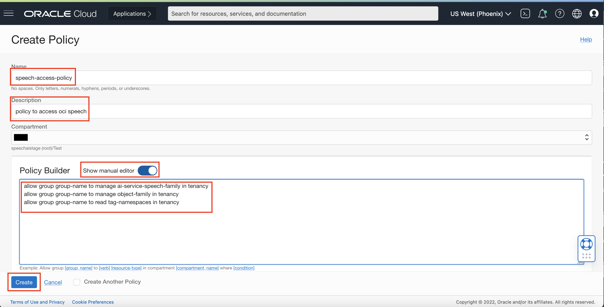
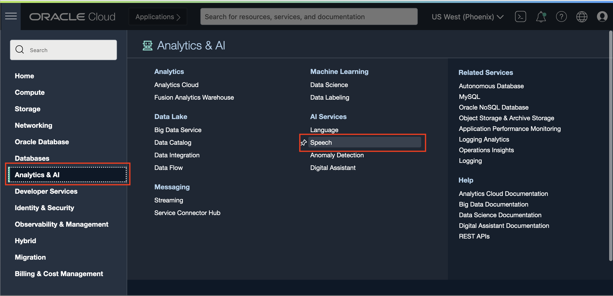
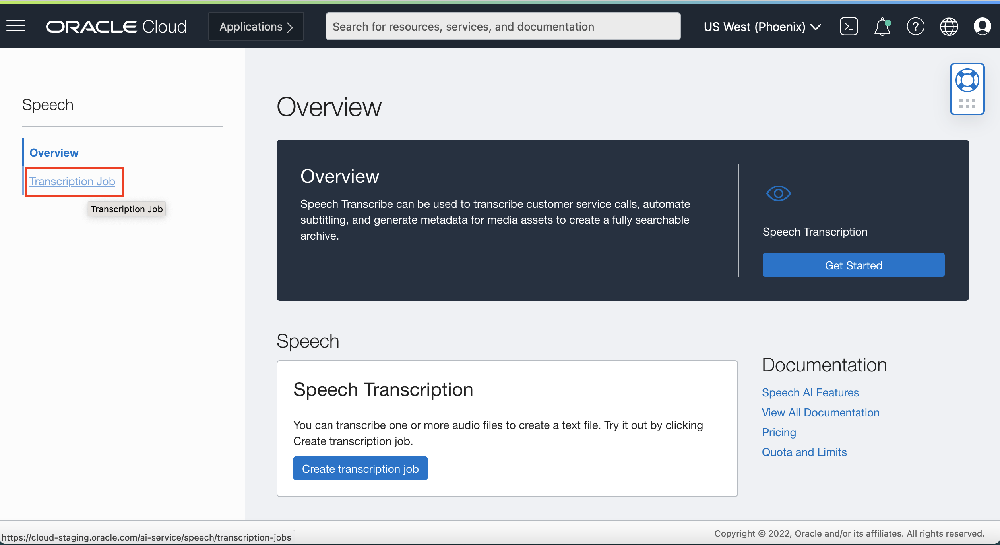
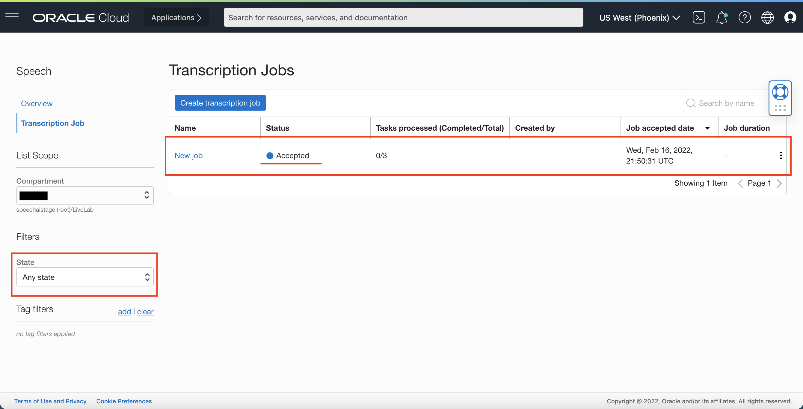
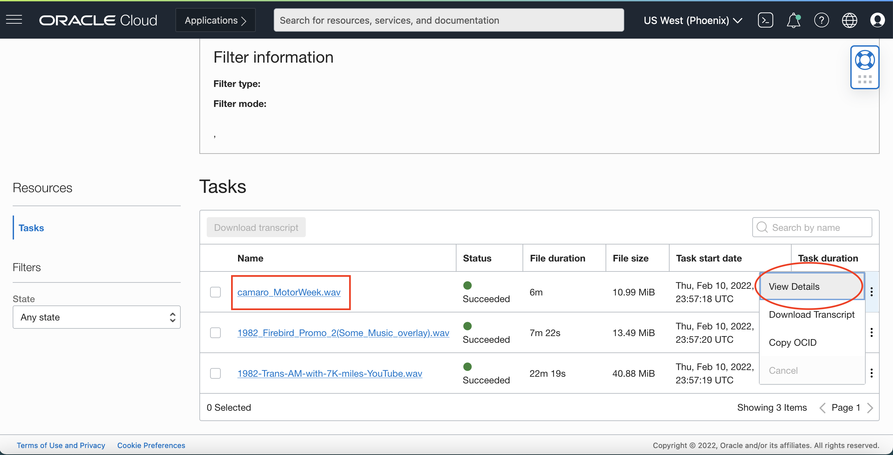

# Lab 1: Transcribing audio with the console

## Introduction
In this session, we will help users get familiar with OCI Speech and teach them how to use our services via the cloud console.

***Estimated Lab Time***: 20 minutes

### Objectives

In this lab, you will:
- Understand a high level overview of the OCI Speech.
- Understand all the capabilities of OCI Speech.
- Understand how to analyze text using OCI Speech via cloud console.

### Prerequisites:
- A Free tier or paid tenancy account in OCI (Oracle Cloud Infrastructure)
- Tenancy is whitelisted to be able to use OCI Speech

## **Policy Setup**

Before you start using OCI Speech, your tenancy administrator should set up the following policies by following below steps:

### 1. Navigate to Policies
Log into OCI Cloud Console. Using the Burger Menu on the top left corner, navigate to Identity & Security and click it, and then select Policies item under Identity.
    


### 2. Create Policy
Click Create Policy
    


### 3. Create a new policy with the following statements:

If you want to allow all the users in your tenancy to use speech service, create a new policy with the below statement:
    ```
    <copy>
    allow any-user to manage ai-service-speech-family in tenancy
    allow any-user to manage object-family in tenancy
    allow any-user to read tag-namespaces in tenancy
    allow any-user to inspect tag-namespaces in tenancy
    </copy>
    ```
    


If you want to limit access to a user group, create a new policy with the below statement:
    ```
    <copy>
    allow group <group-name> to manage ai-service-speech-family in tenancy
    allow group <group-name> to manage object-family in tenancy
    allow group <group-name> to read tag-namespaces in tenancy
    allow group <group-name> to inspect tag-namespaces in tenancy
    </copy>
    ```
    

## **TASK 1:** Use the Console to Transcribe Audio Files

### 1: Navigate to OCI Speech

Log into OCI Cloud Console. Using the Burger Menu on the top left corner, navigate to Analytics and AI menu and click it, and then select Language item under AI services.
    

Then, click "Transcription Job" to navigate to transcription jobs list.
    

### 2: Create Transcription Job

Select the compartment in which you want to create your transcription job, then
click the "Create transcription job" button to begin job creation process
        

### 3: Enter Job Information on Basic Information Page

    ```
    UI UNDER DEVELOPMENT
    ```

### 4: Select Which File(s) From Object Storage to Transcribe in this Job

Select one or more files to transcribe from the specified bucket in object storage then click "Submit"
    

### 5: View Newly Created Job in Transcription Jobs List

Once the job is created you will be directed back to the transcription jobs list page, where the newly created job will be at the top
    

## **TASK 2:** Viewing the Results

To view the result of the transcription we will navigate to each the job and task details page

### 1: Navigating to Job Details Page

Click on the name of the job in the list or click "View details" via the three dots kebab menu on the far right of the job
    

### 2: Job Details Page

The job details page is split into two main sections, on top we can see various metadata relating to the job, such as description, the compartment the job is located in and the language of the transcribed audio

The second section is the <i>job tasks list</i> which shows all the files (now dubbed tasks) we had previously selected to transcribe
    

### 3: Navigate to Individual Task Details

To view metadata and the actual transcription for each task (file) in this job either click the name of the particular task within the list or click "View details" from the three dots kebab menu on the far right
    

### 4: Task Details Page

Similar to the job details page, on the task details page we can view specific metadata for the task in the above section, as well as the audio transcript itself in the lower section
    


## **TASK 3:** Viewing the Results in JSON

You can click on Show JSON button to view the output of the transcription in JSON format.
    

Click Show Standard Results button to leave the JSON view. 
    


Congratulations on completing this lab!

[Proceed to the next section](#next).

## Acknowledgements
* **Authors**
    * Alex Ginella  - Oracle AI Services
    * Rajat Chawla  - Oracle AI Services
    * Ankit Tyagi -  Oracle AI Services
* **Last Updated By/Date**
    * Srijon Sarkar  - Oracle AI Services, September 2021
